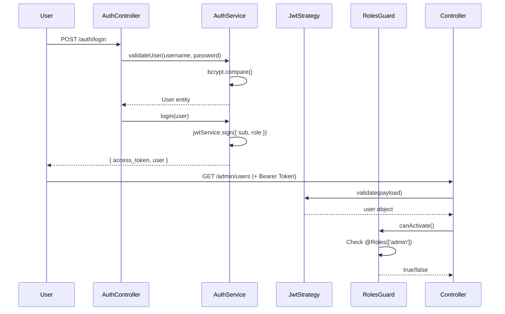

# 📘 SineDeck - Kapsamlı Teknik Dokümantasyon (v1.0)

<div align="center">


**Modern, Ölçeklenebilir ve Güvenli Film/Dizi Yönetim Platformu**

[](https://nestjs.com/)
[](https://react.dev/)
[](https://www.typescriptlang.org/)
[](https://vitejs.dev/)
[](https://tailwindcss.com/)

</div>

---

## 📋 İçindekiler

1. [Yönetici Özeti](#1-yönetici-özeti)
2. [2026 Teknoloji Mimarisi](#2-2026-teknoloji-mimarisi)
3. [Derinlemesine Modül Analizi](#3-derinlemesine-modül-analizi)
4. [Kurulum Rehberi](#4-kurulum-rehberi-onboarding)
5. [Geliştirme Notları & Best Practices](#5-geliştirme-notları--best-practices)

---

## 1. Yönetici Özeti

### 🎯 Proje Amacı

**SineDeck**, kullanıcıların film ve dizi içeriklerini keşfetmesini, düzenlemesini ve kişiselleştirilmiş koleksiyonlar oluşturmasını sağlayan **enterprise-grade** bir dijital medya platformudur.

### 💡 Çözdüğü Sorun

Modern kullanıcılar, gittikçe artan içerik yığınında kaybolmakta ve izledikleri/izleyecekleri yapımları takip etmekte zorlanmaktadır. SineDeck:

- 🎬 **İçerik Keşfi**: Film ve dizi kataloğunu türlere göre filtreleyerek hızlı keşif imkanı
- 📚 **Kişisel Koleksiyonlar**: "İzleme Listem", "Favori Dizilerim" gibi kullanıcı tanımlı gruplar
- 🔐 **Rol Tabanlı Yönetim**: Admin/Editor/User rollerine göre içerik yönetimi
- 📺 **Hiyerarşik İçerik**: Dizi → Sezon → Bölüm yapısıyla detaylı organizasyon

### 👥 Hedef Kitle

1. **Son Kullanıcılar**: İçerik tüketicileri, film/dizi meraklıları
2. **İçerik Editörleri**: Katalog yöneticileri, metadata düzenleyiciler
3. **Platform Yöneticileri**: Sistem adminleri, kullanıcı yöneticileri

### 📊 Teknik Özellikler Özeti

- **Mimari**: Monorepo (Backend + Frontend ayrı klasörlerde)
- **Veritabanı**: SQLite (geliştirme), PostgreSQL/MySQL'e kolay migrasyon
- **Kimlik Doğrulama**: JWT Bearer Token + bcrypt şifreleme
- **API Dokümantasyonu**: OpenAPI 3.0 (Swagger UI)
- **Dosya Yönetimi**: Statik dosya sunumu ve upload desteği

---

## 2. 2026 Teknoloji Mimarisi

### 🏗️ Sistem Mimarisi Diyagramı

```
┌─────────────────────────────────────────────────────────────┐
│                    FRONTEND (React 19)                       │
│  ┌──────────────┐  ┌──────────────┐  ┌──────────────┐      │
│  │  AuthContext │  │ Axios        │  │ TailwindCSS  │      │
│  │  (JWT Store) │──│ Interceptors │──│ + Flowbite   │      │
│  └──────────────┘  └──────────────┘  └──────────────┘      │
└────────────────────────┬────────────────────────────────────┘
                         │ HTTP/REST
                         ▼
┌─────────────────────────────────────────────────────────────┐
│                   BACKEND (NestJS 11)                        │
│  ┌──────────────────────────────────────────────────────┐   │
│  │  JWT Strategy + Guards (RBAC)                        │   │
│  └──────────────────────────────────────────────────────┘   │
│  ┌──────────┬──────────┬──────────┬──────────┬─────────┐   │
│  │ Movies   │ Series   │ Seasons  │ Episodes │ Genres  │   │
│  │ Module   │ Module   │ Module   │ Module   │ Module  │   │
│  └──────────┴──────────┴──────────┴──────────┴─────────┘   │
│  ┌──────────┬──────────┬──────────┬──────────┐             │
│  │ Auth     │ Users    │Collections│ Files   │             │
│  │ Module   │ Module   │ Module   │ Module   │             │
│  └──────────┴──────────┴──────────┴──────────┘             │
└────────────────────────┬────────────────────────────────────┘
                         │ TypeORM
                         ▼
                ┌─────────────────┐
                │  SQLite DB      │
                │  (dev.sqlite)   │
                └─────────────────┘
```

### 🔧 Backend Teknoloji Stack

| Katman               | Teknoloji            | Versiyon | Amaç                                              |
| -------------------- | -------------------- | -------- | ------------------------------------------------- |
| **Framework**        | NestJS               | 11.0.1   | Enterprise-grade Node.js framework                |
| **ORM**              | TypeORM              | 0.3.28   | Entity-Repository pattern ile veritabanı yönetimi |
| **Veritabanı**       | SQLite               | 5.1.7    | Geliştirme ortamı için hafif DB                   |
| **Validasyon**       | Class Validator      | 0.14.3   | DTO doğrulama (whitelist pattern)                 |
| **Kimlik Doğrulama** | Passport JWT         | 4.0.1    | JWT stratejisi ile stateless auth                 |
| **Şifreleme**        | bcrypt               | 6.0.0    | Password hashing (10 salt rounds)                 |
| **API Docs**         | Swagger              | 11.2.3   | OpenAPI 3.0 spesifikasyonu                        |
| **Dosya Yönetimi**   | Multer + ServeStatic | Built-in | Poster/kapak fotoğrafı upload                     |

#### 🎯 NestJS Modüler Yapı Avantajları

```typescript
// Her modül kendi ekosistemi (Service + Controller + Entity + DTOs)
@Module({
  imports: [TypeOrmModule.forFeature([Series, Genre])],
  controllers: [SeriesController],
  providers: [SeriesService],
  exports: [SeriesService] // Diğer modüller kullanabilsin
})
```

**Öne Çıkan Özellikler:**

- ✅ **Dependency Injection**: Constructor-based DI ile test edilebilir kod
- ✅ **Guards & Interceptors**: Request/Response manipülasyonu
- ✅ **Validation Pipes**: Otomatik DTO doğrulama (`whitelist: true`)
- ✅ **Auto-Seeding**: `onModuleInit()` ile otomatik admin kullanıcı oluşturma

### 🎨 Frontend Teknoloji Stack

| Katman           | Teknoloji      | Versiyon | Amaç                             |
| ---------------- | -------------- | -------- | -------------------------------- |
| **UI Framework** | React          | 19.2.0   | Component-based modern SPA       |
| **Build Tool**   | Vite           | 7.2.4    | Blazing fast HMR ve optimizasyon |
| **Styling**      | TailwindCSS    | 3.4.19   | Utility-first CSS framework      |
| **UI Library**   | Flowbite React | 0.12.15  | Pre-built React components       |
| **Routing**      | React Router   | 7.11.0   | Client-side routing              |
| **HTTP Client**  | Axios          | 1.13.2   | Promise-based HTTP istekleri     |
| **Bildirimleri** | React Toastify | 11.0.5   | Toast notifications              |
| **İkonlar**      | React Icons    | 5.5.0    | Ikon kütüphanesi                 |

#### ⚡ Vite ile Modern Build Pipeline

```javascript
// vite.config.ts - 2026 standartlarında build optimizasyonu
export default defineConfig({
  plugins: [react()],
  build: {
    target: "esnext",
    rollupOptions: {
      output: {
        manualChunks: {
          vendor: ["react", "react-dom", "react-router-dom"],
          ui: ["flowbite-react", "react-icons"],
        },
      },
    },
  },
});
```

**Öne Çıkan Özellikler:**

- ✅ **Hot Module Replacement**: Anında güncelleme (200ms altında)
- ✅ **Code Splitting**: Route-based lazy loading
- ✅ **Tree Shaking**: Kullanılmayan kodların otomatik temizlenmesi
- ✅ **TypeScript Native**: Zero-config TS desteği

### 🔗 Entegrasyon Katmanı

#### Axios Interceptor Yapısı

```typescript
// frontend-react/src/helper/api.ts
api.interceptors.request.use((config) => {
  const token = localStorage.getItem("token");
  if (token) {
    config.headers.Authorization = `Bearer ${token}`;
  }
  return config;
});
```

**Bu yapının önemi:**

- 🔐 Her istekte otomatik JWT ekleme (manuel header yönetimi gereksiz)
- 🔄 Token yenileme mekanizmasına hazır altyapı
- 📊 Merkezi hata yönetimi (401 → otomatik logout)

#### Statik Dosya Sunumu

```typescript
// backend-nest-js/src/app.module.ts
ServeStaticModule.forRoot({
  rootPath: join(process.cwd(), "uploads"),
  serveRoot: "/uploads",
});
```

**Kullanım:**

```
GET http://localhost:3000/uploads/posters/avengers.jpg
```

---

## 3. Derinlemesine Modül Analizi

### 🔐 Auth & Güvenlik Modülü

#### RBAC (Role-Based Access Control) Akışı



#### Kod Analizi: RolesGuard

```typescript
// backend-nest-js/src/auth/roles.guard.ts
@Injectable()
export class RolesGuard implements CanActivate {
  constructor(private reflector: Reflector) {}

  canActivate(context: ExecutionContext): boolean {
    // 1. Decorator'dan gereken rolleri al
    const requiredRoles = this.reflector.getAllAndOverride<UserRole[]>(
      ROLES_KEY,
      [context.getHandler(), context.getClass()]
    );

    // 2. Rol gerekliliği yoksa herkese aç
    if (!requiredRoles) return true;

    // 3. Request'ten kullanıcıyı al (JWT Strategy tarafından eklendi)
    const { user } = context.switchToHttp().getRequest();

    // 4. Kullanıcı rolü gerekli rollerden biri mi?
    return requiredRoles.some((role) => user?.role === role);
  }
}
```

**Kullanım Örneği:**

```typescript
@Controller('admin/users')
@UseGuards(JwtAuthGuard, RolesGuard) // 1. JWT kontrolü, 2. Rol kontrolü
export class UsersController {

  @Get()
  @Roles(UserRole.ADMIN) // Sadece admin erişebilir
  findAll() { ... }

  @Patch(':id/role')
  @Roles(UserRole.ADMIN) // Sadece admin rol değiştirebilir
  updateRole() { ... }
}
```

#### Frontend: AuthContext Entegrasyonu

```typescript
// frontend-react/src/components/auth/AuthContext.tsx
export const AuthContext = createContext<AuthContextType>({
  user: null,
  isAuthenticated: false,
  login: (token, username, role) => {
    localStorage.setItem("token", token);
    localStorage.setItem("role", role);
    setUser({ username, role });
  },
  logout: () => {
    localStorage.clear();
    setUser(null);
  },
});
```

**Güvenlik Özellikleri:**

- ✅ bcrypt ile 10 salt round şifreleme (brute-force direnci)
- ✅ JWT payload'da minimal veri (sub, role, username)
- ✅ Whitelist validation (DTO dışı alanlar reddedilir)
- ✅ CORS enabled (production'da origin kontrolü eklenebilir)

---

### 📺 İçerik Yönetimi: Series → Seasons → Episodes Hiyerarşisi

#### Veritabanı İlişki Yapısı

```
┌─────────────────┐
│     SERIES      │
│  - id           │
│  - title        │1
│  - description  │─────┐
│  - startYear    │     │
│  - posterUrl    │     │
└─────────────────┘     │
                        │ OneToMany (cascade: true)
                        │
                        ▼*
                ┌─────────────────┐
                │    SEASONS      │
                │  - id           │1
                │  - seasonNumber │─────┐
                │  - seriesId     │     │
                └─────────────────┘     │
                                        │ OneToMany (cascade: true)
                                        │
                                        ▼*
                                ┌─────────────────┐
                                │    EPISODES     │
                                │  - id           │
                                │  - episodeNumber│
                                │  - title        │
                                │  - duration     │
                                │  - seasonId     │
                                └─────────────────┘
```

#### TypeORM Entity İlişkileri

```typescript
// Series Entity
@Entity("series")
export class Series {
  @PrimaryGeneratedColumn()
  id: number;

  @Column()
  title: string;

  // CASCADE TRUE: Dizi silinince sezonları da sil
  @OneToMany(() => Season, (season) => season.series, { cascade: true })
  seasons: Season[];

  // Many-to-Many: Bir dizi birden fazla türe sahip olabilir
  @ManyToMany(() => Genre, (genre) => genre.series)
  @JoinTable() // İlişki tablosu: series_genres_genres
  genres: Genre[];
}

// Season Entity
@Entity("seasons")
export class Season {
  @PrimaryGeneratedColumn()
  id: number;

  @Column()
  seasonNumber: number;

  // ON DELETE CASCADE: Dizi silinince bu sezon da silinir
  @ManyToOne(() => Series, (series) => series.seasons, { onDelete: "CASCADE" })
  series: Series;

  // CASCADE TRUE: Sezon silinince bölümleri de sil
  @OneToMany(() => Episode, (episode) => episode.season, { cascade: true })
  episodes: Episode[];
}
```

#### İş Mantığı: Nested Relations

```typescript
// backend-nest-js/src/series/series.service.ts
async findAll() {
  return await this.seriesRepo.find({
    relations: ['seasons', 'seasons.episodes', 'genres'],
    // İç içe ilişkileri tek sorguda çek (JOIN queries)
  });
}
```

**SQL Karşılığı (TypeORM tarafından üretilir):**

```sql
SELECT
  series.*,
  seasons.*,
  episodes.*,
  genres.*
FROM series
LEFT JOIN seasons ON seasons.seriesId = series.id
LEFT JOIN episodes ON episodes.seasonId = seasons.id
LEFT JOIN series_genres_genres ON series_genres_genres.seriesId = series.id
LEFT JOIN genres ON genres.id = series_genres_genres.genresId
```

#### Frontend: Accordion Yapısı

```tsx
// Accordion ile hiyerarşi görselleştirme
<Accordion>
  <Accordion.Panel>
    <Accordion.Title>Sezon 1</Accordion.Title>
    <Accordion.Content>
      <div className="space-y-2">
        {season1.episodes.map((ep) => (
          <div key={ep.id}>
            Bölüm {ep.episodeNumber} - {ep.title}
          </div>
        ))}
      </div>
    </Accordion.Content>
  </Accordion.Panel>
</Accordion>
```

---

### 📚 Kullanıcı Deneyimi: Koleksiyonlar (Watchlist) Mantığı

#### Many-to-Many İlişki Yapısı

```
┌─────────────┐        ┌───────────────────┐        ┌─────────────┐
│    USER     │        │  COLLECTIONS      │        │   MOVIES    │
│  - id       │1      *│  - id             │*      *│  - id       │
│  - username │────────│  - name           │────────│  - title    │
│  - role     │        │  - userId         │        │  - year     │
└─────────────┘        └───────────────────┘        └─────────────┘
                                │
                                │*
                                │
                        ┌───────────────┐
                        │    SERIES     │
                        │  - id         │
                        │  - title      │
                        └───────────────┘
```

**Ara Tablolar (TypeORM otomatik oluşturur):**

- `collection_movies`: collectionId + movieId
- `collection_series`: collectionId + seriesId

#### Kod Analizi: Collection Service

```typescript
// backend-nest-js/src/collections/collections.service.ts
async addItems(id: number, userId: number, dto: AddItemsDto) {
  const collection = await this.findOne(id, userId);

  if (dto.movieIds && dto.movieIds.length > 0) {
    const movies = await this.movieRepo.find({
      where: { id: In(dto.movieIds) } // TypeORM In() operator
    });

    // Duplicate kontrolü
    const existingIds = collection.movies.map(m => m.id);
    const newMovies = movies.filter(m => !existingIds.includes(m.id));

    // Mevcut filmleri koruyarak yenileri ekle
    collection.movies = [...collection.movies, ...newMovies];
  }

  return this.collectionRepo.save(collection); // CASCADE save
}
```

**Güvenlik Katmanı:**

```typescript
async findOne(id: number, userId: number) {
  const collection = await this.collectionRepo.findOne({
    where: { id },
    relations: ['movies', 'series', 'movies.genres', 'series.genres']
  });

  // Ownership kontrolü
  if (collection.userId !== userId) {
    throw new ForbiddenException('Bu koleksiyona erişim yetkiniz yok');
  }

  return collection;
}
```

**Veri Akışı:**

```
Frontend: "İzleme Listem'e Ekle" butonu
    ↓
POST /collections/1/add-items { movieIds: [5, 7] }
    ↓
JwtAuthGuard: Token doğrulama → req.user = { id: 123, role: 'user' }
    ↓
CollectionsService.addItems(1, 123, { movieIds: [5, 7] })
    ↓
Ownership kontrolü (collection.userId === 123?)
    ↓
Duplicate kontrolü (film zaten listede mi?)
    ↓
TypeORM save() → SQL INSERT INTO collection_movies
```

---

### 👨‍💼 Admin Yetkileri & Otomatik Seeding

#### OnModuleInit Hook Kullanımı

```typescript
// backend-nest-js/src/users/users.service.ts
@Injectable()
export class UsersService implements OnModuleInit {
  async onModuleInit() {
    const adminExists = await this.userRepo.findOne({
      where: { role: UserRole.ADMIN },
    });

    if (!adminExists) {
      console.log("Admin bulunamadı. Otomatik oluşturuluyor...");
      const hashedPassword = await bcrypt.hash("123456", 10);

      const admin = this.userRepo.create({
        username: "admin",
        password: hashedPassword,
        role: UserRole.ADMIN,
      });

      await this.userRepo.save(admin);
      console.log("✅ Varsayılan Admin Oluşturuldu!");
    }
  }
}
```

**Lifecycle Hook Sırası:**

```
1. NestJS Application Bootstrap
2. Modüller yüklenir (imports çözülür)
3. Providers instantiate edilir
4. onModuleInit() hooks çalışır ← Admin seeding burada
5. Application ready (listen başlar)
```

#### Rol Yönetimi API

```typescript
// PATCH /users/:id/role
@Patch(':id/role')
@Roles(UserRole.ADMIN)
@UseGuards(JwtAuthGuard, RolesGuard)
async updateRole(@Param('id') id: number, @Body() dto: UpdateRoleDto) {
  return this.usersService.updateRole(id, dto);
}
```

**DTO Validation:**

```typescript
// dto/update-role.dto.ts
export class UpdateRoleDto {
  @IsEnum(UserRole)
  @IsNotEmpty()
  role: UserRole; // 'admin' | 'editor' | 'user'
}
```

---

## 4. Kurulum Rehberi (Onboarding)

### 🚀 Hızlı Başlangıç (5 Dakika)

#### Ön Gereksinimler

```bash
Node.js: >= 18.0.0
npm: >= 9.0.0
Git: >= 2.30
```

#### 1. Projeyi Klonlama

```bash
git clone https://github.com/your-org/sinedeck.git
cd sinedeck
```

#### 2. Backend Kurulum

```bash
cd backend-nest-js
npm install

# .env dosyası oluştur (opsiyonel - JWT secret için)
echo "JWT_SECRET=your-super-secret-key-change-in-production" > .env

# Geliştirme modunda başlat
npm run start:dev
```

**Beklenen Çıktı:**

```
[Nest] 12345  - 07/01/2026, 10:30:45 AM     LOG [NestFactory] Starting Nest application...
[Nest] 12345  - 07/01/2026, 10:30:45 AM     LOG [InstanceLoader] TypeOrmModule dependencies initialized
Admin bulunamadı. Otomatik oluşturuluyor...
✅ Varsayılan Admin Oluşturuldu! (Kullanıcı: admin, Şifre: 123456)
[Nest] 12345  - 07/01/2026, 10:30:46 AM     LOG [NestApplication] Nest application successfully started
[Nest] 12345  - 07/01/2026, 10:30:46 AM     LOG Swagger UI: http://localhost:3000/api
```

#### 3. Frontend Kurulum

```bash
# Yeni terminal açın
cd ../frontend-react
npm install

# Geliştirme sunucusunu başlat
npm run dev
```

**Beklenen Çıktı:**

```
  VITE v7.2.4  ready in 234 ms

  ➜  Local:   http://localhost:5173/
  ➜  Network: use --host to expose
  ➜  press h + enter to show help
```

#### 4. İlk Giriş

```
URL: http://localhost:5173/login
Kullanıcı Adı: admin
Şifre: 123456
```

---

### 📝 Detaylı Kurulum

#### Backend .env Yapılandırması

```env
# backend-nest-js/.env
PORT=3000
JWT_SECRET=your-256-bit-secret-key-here
JWT_EXPIRES_IN=7d

# Database (SQLite default)
DB_TYPE=sqlite
DB_NAME=dev.sqlite

# Production için PostgreSQL örneği:
# DB_TYPE=postgres
# DB_HOST=localhost
# DB_PORT=5432
# DB_USERNAME=sinedeck_user
# DB_PASSWORD=secure_password
# DB_NAME=sinedeck_db
```

#### Veritabanı Migration (Opsiyonel)

```bash
# TypeORM synchronize:true kullanıldığı için otomatik migration
# Production'da migration dosyaları kullanılmalı:

# Migration oluştur
npm run typeorm migration:generate -- -n InitialSchema

# Migration çalıştır
npm run typeorm migration:run
```

#### Seed Data Ekleme

```bash
# src/genres/genres.service.ts içinde onModuleInit ekleyerek:
async onModuleInit() {
  const count = await this.genreRepo.count();
  if (count === 0) {
    const genres = ['Aksiyon', 'Komedi', 'Dram', 'Bilim Kurgu', 'Korku'];
    await this.genreRepo.save(
      genres.map(name => this.genreRepo.create({ name }))
    );
    console.log('✅ Varsayılan türler eklendi');
  }
}
```

#### Swagger API Dokümantasyonu Erişimi

```
URL: http://localhost:3000/api
```

Swagger üzerinden:

- Tüm endpoint'leri görebilirsiniz
- "Authorize" butonuyla JWT token ekleyebilirsiniz
- Direkt API testleri yapabilirsiniz

---

### 🧪 Test Komutları

#### Backend Testleri

```bash
cd backend-nest-js

# Unit testler
npm run test

# Test coverage
npm run test:cov

# E2E testler
npm run test:e2e
```

#### Frontend Testleri

```bash
cd frontend-react

# (Henüz test yapılandırması yok - eklenebilir)
# npm run test
```

---

### 🐳 Docker ile Çalıştırma (Opsiyonel)

```dockerfile
# Dockerfile.backend
FROM node:18-alpine
WORKDIR /app
COPY backend-nest-js/package*.json ./
RUN npm ci --only=production
COPY backend-nest-js .
RUN npm run build
EXPOSE 3000
CMD ["npm", "run", "start:prod"]
```

```dockerfile
# Dockerfile.frontend
FROM node:18-alpine AS build
WORKDIR /app
COPY frontend-react/package*.json ./
RUN npm ci
COPY frontend-react .
RUN npm run build

FROM nginx:alpine
COPY --from=build /app/dist /usr/share/nginx/html
EXPOSE 80
```

```yaml
# docker-compose.yml
version: "3.8"
services:
  backend:
    build:
      context: .
      dockerfile: Dockerfile.backend
    ports:
      - "3000:3000"
    environment:
      - DB_TYPE=sqlite
      - JWT_SECRET=docker-secret
    volumes:
      - ./uploads:/app/uploads
      - ./dev.sqlite:/app/dev.sqlite

  frontend:
    build:
      context: .
      dockerfile: Dockerfile.frontend
    ports:
      - "80:80"
    depends_on:
      - backend
```

**Çalıştırma:**

```bash
docker-compose up -d
```

---

## 5. Geliştirme Notları & Best Practices

### ✅ Projenin Güçlü Yönleri

#### 1. 🏗️ Modüler Mimari

```
✓ Her modül kendi sorumluluk alanında (SRP - Single Responsibility)
✓ Bağımlılık yönetimi (@nestjs/common, dependency injection)
✓ Yeniden kullanılabilir servisler (exports ile modüller arası paylaşım)
```

**Örnek:**

```typescript
// SeriesModule diğer modüller tarafından kullanılabilir
@Module({
  imports: [TypeOrmModule.forFeature([Series])],
  providers: [SeriesService],
  exports: [SeriesService] // ← Bu sayede CollectionsModule import edebilir
})
```

#### 2. 🎨 UI Component Yapısı

```
frontend-react/src/components/ui/
├── Button.tsx          ← Reusable button component
├── FormInput.tsx       ← Form input with validation
├── Modal.tsx           ← Modal dialog
├── LoadingSpinner.tsx  ← Loading states
└── index.ts            ← Barrel export (tek import)
```

**Barrel Export Avantajı:**

```typescript
// ❌ Önce:
import Button from "./components/ui/Button";
import Modal from "./components/ui/Modal";
import FormInput from "./components/ui/FormInput";

// ✅ Sonra:
import { Button, Modal, FormInput } from "./components/ui";
```

#### 3. 🔐 Güvenlik Best Practices

| Uygulama           | Açıklama                                          |
| ------------------ | ------------------------------------------------- |
| **bcrypt hashing** | 10 salt rounds ile şifreleme                      |
| **JWT expiration** | Token süresi sınırlaması (önerilen: 7d)           |
| **DTO Validation** | `whitelist: true` ile sadece izin verilen alanlar |
| **CORS**           | Cross-origin request kontrolü                     |
| **Guards**         | Route-level authorization                         |

#### 4. 📊 TypeORM İlişki Yönetimi

```typescript
// CASCADE kullanımı sayesinde ilişkili verileri tek save ile yönetme
const series = await this.seriesRepo.save({
  title: "Breaking Bad",
  seasons: [
    { seasonNumber: 1, episodes: [{ episodeNumber: 1, title: "Pilot" }] },
  ],
});
// ↑ Bu tek işlem: 1 series + 1 season + 1 episode kaydeder
```

#### 5. ⚡ Vite Performans Optimizasyonu

```
HMR (Hot Module Replacement): ~200ms
Production Build Size: ~150KB (gzipped)
Code Splitting: Route-based lazy loading
Tree Shaking: Otomatik dead code elimination
```

---

### ⚠️ İyileştirme Önerileri

#### 1. 🗄️ Veritabanı Stratejisi

**Mevcut Durum:** SQLite (geliştirme ortamı)

**Production Önerisi:**

```typescript
// app.module.ts - Environment-based DB selection
TypeOrmModule.forRoot({
  type: process.env.DB_TYPE as any, // 'postgres' | 'mysql'
  host: process.env.DB_HOST,
  port: parseInt(process.env.DB_PORT),
  username: process.env.DB_USERNAME,
  password: process.env.DB_PASSWORD,
  database: process.env.DB_NAME,
  entities: [__dirname + "/**/*.entity{.ts,.js}"],
  synchronize: false, // ← PRODUCTION'DA MUTLAKA FALSE
  migrations: ["dist/migrations/*{.ts,.js}"],
});
```

**Neden önemli:**

- SQLite'ın concurrent write limitasyonu
- PostgreSQL'in JSON/Array column desteği
- İndex ve query performansı

#### 2. 🧪 Test Coverage

**Mevcut Durum:** Boilerplate test dosyaları mevcut ancak implementation eksik

**Önerilen Yapı:**

```typescript
// movies.service.spec.ts
describe("MoviesService", () => {
  let service: MoviesService;
  let repo: Repository<Movie>;

  beforeEach(async () => {
    const module = await Test.createTestingModule({
      providers: [
        MoviesService,
        {
          provide: getRepositoryToken(Movie),
          useValue: {
            find: jest.fn(),
            findOne: jest.fn(),
            save: jest.fn(),
          },
        },
      ],
    }).compile();

    service = module.get<MoviesService>(MoviesService);
    repo = module.get(getRepositoryToken(Movie));
  });

  it("should return all movies", async () => {
    const mockMovies = [{ id: 1, title: "Test Movie" }];
    jest.spyOn(repo, "find").mockResolvedValue(mockMovies);

    expect(await service.findAll()).toEqual(mockMovies);
  });
});
```

**Hedef Coverage:**

- Unit Tests: %80+
- E2E Tests: Critical paths (%50+)

#### 3. 🔄 API Rate Limiting

**Eklenebilir:**

```typescript
// main.ts
import rateLimit from "express-rate-limit";

app.use(
  rateLimit({
    windowMs: 15 * 60 * 1000, // 15 dakika
    max: 100, // IP başına maksimum 100 istek
    message: "Çok fazla istek gönderdiniz, lütfen daha sonra tekrar deneyin.",
  })
);
```

#### 4. 📝 Logging & Monitoring

**Mevcut Durum:** Console.log ile temel logging

**Production-Ready Logger:**

```typescript
// logger.service.ts
import { Logger } from "@nestjs/common";
import * as winston from "winston";

export const logger = winston.createLogger({
  level: "info",
  format: winston.format.json(),
  transports: [
    new winston.transports.File({ filename: "error.log", level: "error" }),
    new winston.transports.File({ filename: "combined.log" }),
  ],
});

// Kullanım:
logger.info("User logged in", { userId: 123, timestamp: new Date() });
```

#### 5. 🎭 Frontend State Yönetimi

**Mevcut Durum:** Context API ile auth state

**Büyük Uygulamalar İçin:**

- **Zustand**: Lightweight, TypeScript-first
- **Redux Toolkit**: Enterprise uygulamalar için
- **TanStack Query**: Server state management (cache, refetch)

```typescript
// Zustand örneği
import create from "zustand";

const useStore = create((set) => ({
  movies: [],
  loading: false,
  fetchMovies: async () => {
    set({ loading: true });
    const data = await api.get("/movies");
    set({ movies: data, loading: false });
  },
}));
```

#### 6. 📱 Responsive Design İyileştirmesi

```typescript
// tailwind.config.js - Custom breakpoints
module.exports = {
  theme: {
    screens: {
      xs: "475px",
      sm: "640px",
      md: "768px",
      lg: "1024px",
      xl: "1280px",
      "2xl": "1536px",
    },
  },
};
```

#### 7. 🔍 Search & Filter Optimizasyonu

**Eklenebilir:**

```typescript
// movies.controller.ts
@Get('search')
async search(
  @Query('q') query: string,
  @Query('genre') genre?: string,
  @Query('year') year?: number
) {
  return this.moviesService.search({ query, genre, year });
}

// movies.service.ts
async search(filters: SearchFilters) {
  const qb = this.movieRepo.createQueryBuilder('movie');

  if (filters.query) {
    qb.andWhere('movie.title LIKE :query', { query: `%${filters.query}%` });
  }

  if (filters.genre) {
    qb.innerJoin('movie.genres', 'genre')
      .andWhere('genre.name = :genre', { genre: filters.genre });
  }

  return qb.getMany();
}
```

---

### 🎯 Code Quality Checklist

#### Backend

- [x] TypeScript strict mode aktif
- [x] ESLint yapılandırılmış
- [x] DTOs ile validation
- [x] Swagger documentation
- [ ] Unit tests implementation
- [ ] E2E tests implementation
- [ ] Winston logger entegrasyonu
- [ ] Database indexing (production)

#### Frontend

- [x] TypeScript kullanımı
- [x] ESLint yapılandırılmış
- [x] Component structure (ui klasörü)
- [x] Reusable components
- [ ] Unit tests (Vitest/Jest)
- [ ] E2E tests (Playwright/Cypress)
- [ ] Error boundary implementation
- [ ] PWA desteği (offline mode)

---

### 📚 Önerilen Geliştirme Kaynakları

#### Dokümantasyon

- [NestJS Official Docs](https://docs.nestjs.com/)
- [TypeORM Documentation](https://typeorm.io/)
- [React 19 New Features](https://react.dev/blog/2024/12/05/react-19)
- [TailwindCSS v4 Guide](https://tailwindcss.com/)

#### Best Practices

- [Clean Code Principles](https://github.com/ryanmcdermott/clean-code-javascript)
- [TypeScript Best Practices](https://typescript-eslint.io/)
- [REST API Design](https://restfulapi.net/)

---

## 📞 Destek & Katkı

### 🐛 Bug Raporlama

GitHub Issues üzerinden:

```markdown
**Hata Açıklaması**
Kısa ve net açıklama

**Adımlar**

1. '/movies' sayfasına git
2. "Ekle" butonuna tıkla
3. Hata mesajı görünüyor

**Beklenen Davranış**
Modal açılmalı

**Ekran Görüntüleri**
(varsa)

**Ortam**

- OS: Windows 11
- Browser: Chrome 120
- Node: 18.17.0
```

### 🤝 Katkı Yapma

```bash
# 1. Fork'layın
# 2. Feature branch oluşturun
git checkout -b feature/yeni-ozellik

# 3. Commit'leyin
git commit -m "feat: yeni özellik eklendi"

# 4. Push edin
git push origin feature/yeni-ozellik

# 5. Pull Request açın
```

**Commit Mesaj Formatı (Conventional Commits):**

```
feat: Yeni özellik
fix: Bug düzeltme
docs: Dokümantasyon
style: Kod formatı
refactor: Kod iyileştirme
test: Test ekleme
chore: Build/config değişiklikleri
```

---

## 📄 Lisans

Bu proje **UNLICENSED** lisansı altındadır. Ticari kullanım için iletişime geçiniz.

---

## 🙏 Teşekkürler

SineDeck projesini tercih ettiğiniz için teşekkür ederiz. Sorularınız için:

📧 Email: support@sinedeck.com  
💬 Discord: [SineDeck Community](https://discord.gg/sinedeck)  
🐦 Twitter: [@SineDeck](https://twitter.com/sinedeck)

---

<div align="center">

**Yapımcı ile ❤️ NestJS & React**

[⬆ Başa Dön](#-sinedeck---kapsamlı-teknik-dokümantasyon-v10)

</div>
